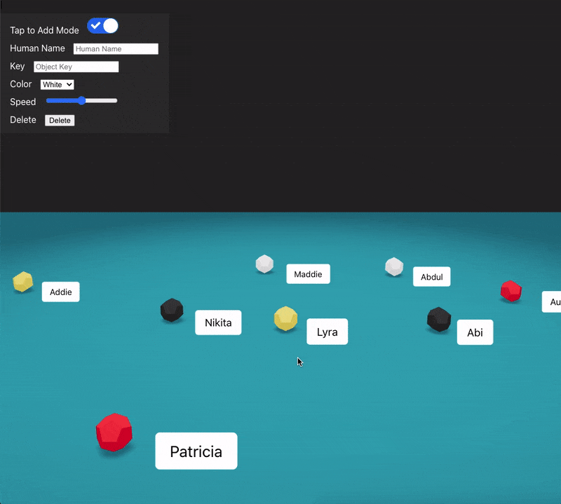

## Mothership
Mothership is a 3D shared environment that lets multiple clients create, update, and remove objects (refered to as robots) in realtime.

## Demo
- [Demo](http://34.68.245.43:8080/)

## Build

To make things easy, I've dockerized both the backend and client (see Dockerfile). The MongoDB replica set has also been configured and dockerized see (docker-compose.yml).

To build, clone this repo, cd to `/mothership`, then run

    docker-compose up

You should now be able to open `localhost:8080` on the browser and play around

## How It Works

Mothership is built using React, Socket.io, and Threejs on the frontend (see folder `client`) and Nodejs, Socket.io, and MongoDB on the backend (see folder `backend`). 

The following diagram shows how system communication is done.

In order to create, update, or modify an object on the UI, an API call is made to the appropriate express endpoint.
The endpoint parses the request and adds the appropriate data to the database.

In order to allow realtime functionality and detect changes in the database,
the Mongo database is replicated. This has many advantages such as redundancy and high availability, but most importantly, it allows quickly detecting changes on the dataset without risk of tailing the oplog. 

[comment]: <> (Since changes are detected at the database level, all change notification delay maintain a consistent cadence proportional to the size of the database. )

As soon as the database detects a change, a change stream triggers the Socket.io implementation to send a message to the frontend. The frontend interprets this message and modifies the UI accordingly. 

The UI doesn't show a newly created object until it receives a confirmation from the server that a new object has been added to the database. This is important because it helps avoid a UI rollback if the object is created on the user's machine but isn't reflected in the database due to some server failure. The following storyboard shows an example of this.

Because it uses reusable Threejs components via React, it's quite fast.

Since this is a realtime app, if the user is disconnected due to a network error, a loading overlay screen is shown until the connection is reestablished.

The app also checks off PWA requirements and uses service workers in the background. According to Lighthouse:

[comment]: <> (## Features)

