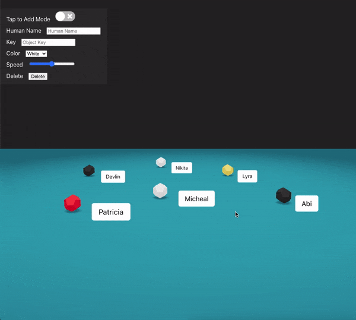
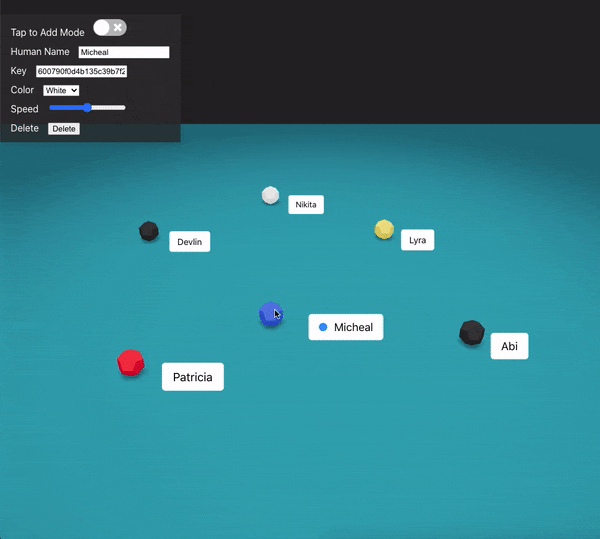
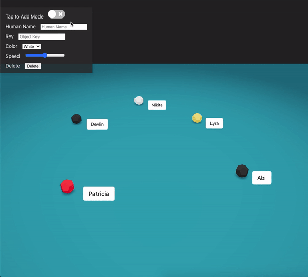
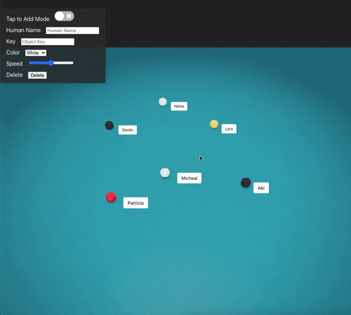
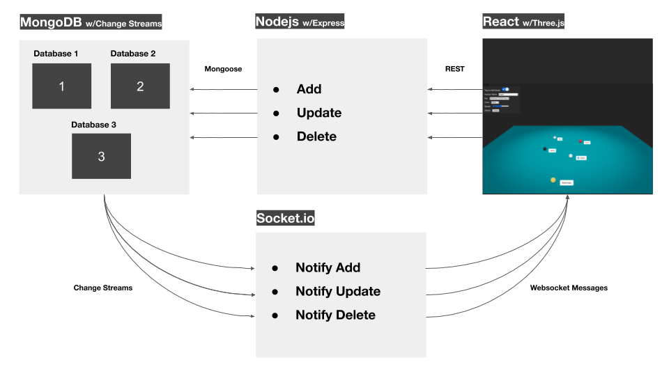
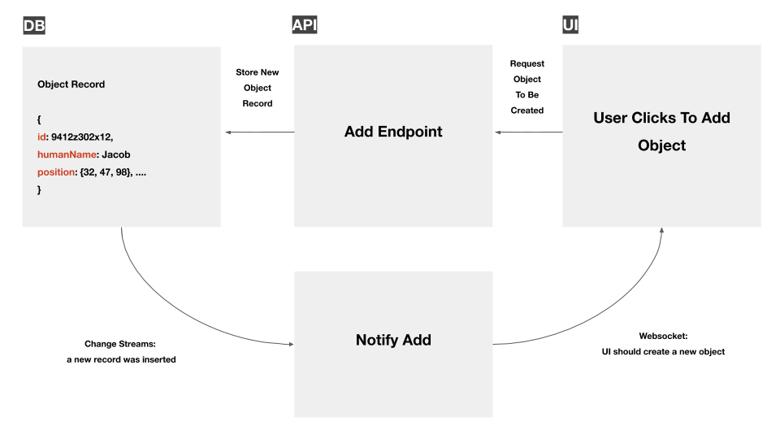
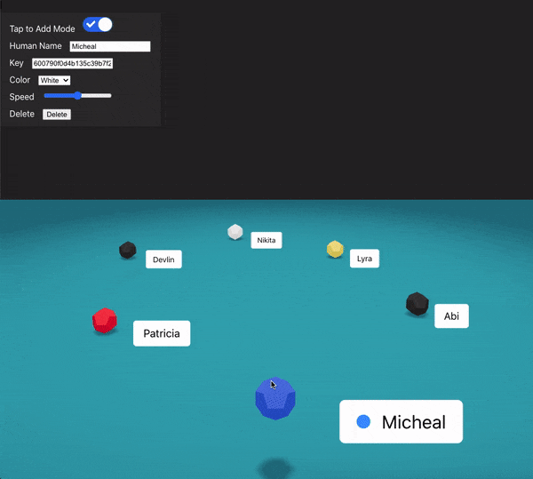
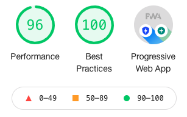
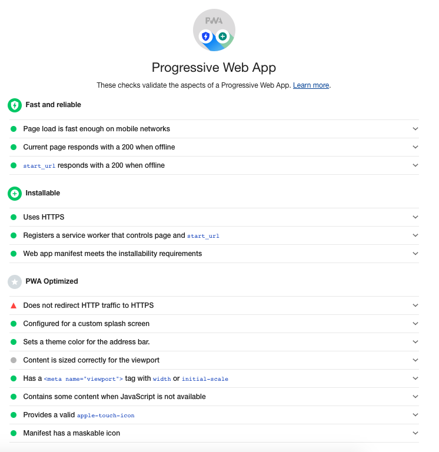

<h1 align="center">
  <a href="http://34.68.245.43:8080/"></a>
  <br>
  Mothership
</h1>

<h4 align="center">Live React & Threejs 3D Environment </h4>


<blockquote align="center">
 Mothership is a 3D shared environment that lets multiple clients create, update, and remove objects (referred to as 'robots') in realtime.

</blockquote>

<p align="center">
  <a href="#demo">Demo</a>&nbsp;|&nbsp;<a href="#how-it-works">How It Works</a>&nbsp;|&nbsp;<a href="#examples">Examples</a>
</p>


## Demo
- [http://34.68.245.43:8080/](http://34.68.245.43:8080/)


## Build

To make things easy, I've dockerized both the backend and client (see Dockerfile). The MongoDB replica set has also been configured and dockerized see (docker-compose.yml).

To build, clone this repo, cd to `/mothership`, then run
```bash
$ docker-compose up
```

You should now be able to open `localhost:8080` on the browser and play around


## Examples


### Select

To select an object, hover over it (or on mobile, tap it). The pulsing dot indicates it's now selected. Click or tap away to deselect.




### Move/Modify

To move an object, select it and drag it across the plane. Once selected, you can modify it using the form. To remove it, click the delete button.



### Add

To add a new object, turn on `tap to add mode` and click anywhere on the plane. This will create a white object with a random name.




### Orbit

To orbit around the environment, make sure no object is selected then click and drag the screen. Note that the orbit is fixed on mobile devices to avoid expensive rendering.




## How It Works

Mothership is built using React, Socket.io, and Threejs on the frontend (see folder `client`) and Nodejs, Socket.io, and MongoDB on the backend (see folder `backend`). 

The following diagram shows how system communication is done.



In order to create, update, or modify an object on the UI, an API call is made to the appropriate Express endpoint.
The endpoint parses the request and adds the appropriate data to the database.

In order to allow realtime functionality and detect changes in the database,
the Mongo database is replicated. This has many advantages such as redundancy and high availability, but most importantly, it allows quickly detecting changes on the dataset without risk of tailing the oplog. 

As soon as the database detects a change, a change stream triggers the Socket.io implementation to send a message to the frontend. The frontend interprets this message and modifies the UI accordingly. 

Something to note is that the UI doesn't show a newly created object until it receives a confirmation from the server that a new object has been added to the database. This is important because it helps avoid a UI rollback if the object is created on the user's machine but isn't reflected in the database due to some server failure. The following storyboard shows an example of this.



Since this is a realtime app, if the user is disconnected due to a network error, a loading overlay screen is shown until the connection is reestablished.




Because it uses reusable Threejs components via React, the system is quite fast. According to Lighthouse:




The app also checks off PWA requirements and utilizes service workers, web notifications (requires https), and manifests.



